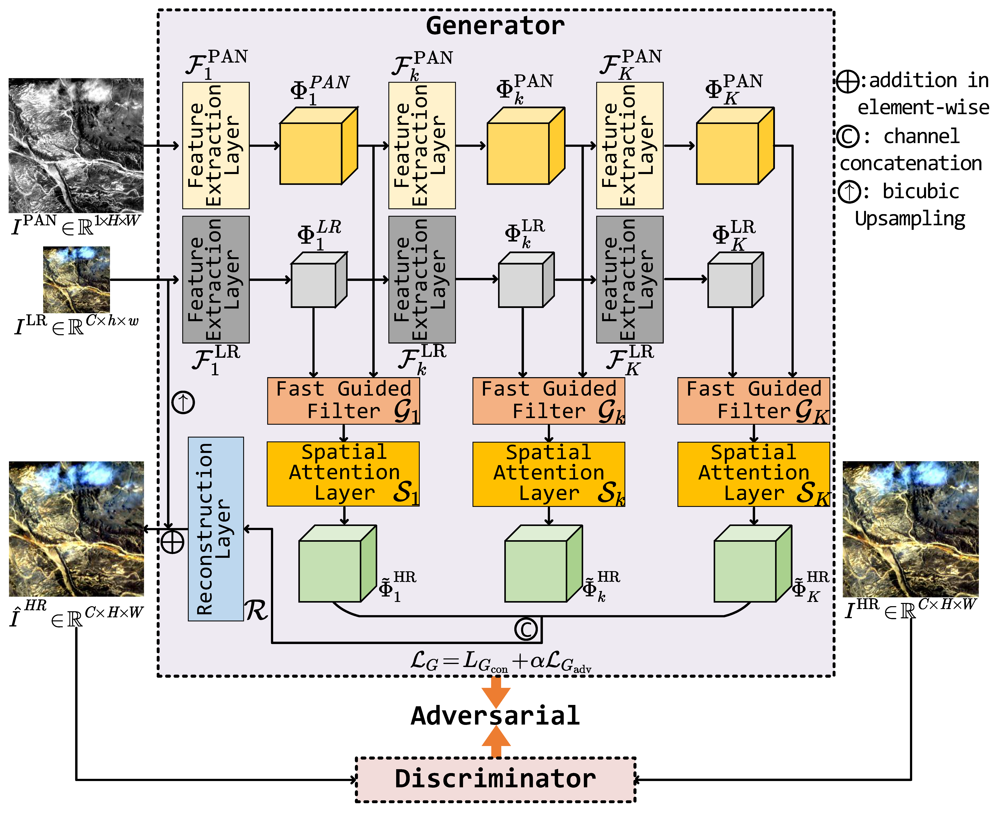
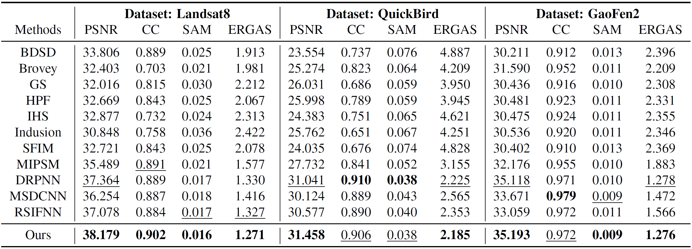

# FGF-GAN
The official code for FGF-GAN: A Lightweight Generative Adversarial Network for Pansharpening via Fast Guided Filter (ICME 2021 Oral).

- [*[Paper]*](https://ieeexplore.ieee.org/abstract/document/9428272)
- [*[ArXiv]*](https://arxiv.org/abs/2101.00062)

## Citation

*[Zixiang Zhao](https://zhaozixiang1228.github.io/), [Jiangshe Zhang](http://gr.xjtu.edu.cn/web/jszhang), [Shuang Xu](https://xsxjtu.github.io/), [Kai Sun](), [Lu Huang](), [Junmin Liu](https://scholar.google.com/citations?user=C9lKEu8AAAAJ&hl=zh-CN) and [Chunxia Zhang](https://scholar.google.com/citations?user=b5KG5awAAAAJ&hl=zh-CN), "FGF-GAN: A Lightweight Generative Adversarial Network for Pansharpening via Fast Guided Filter," 2021 IEEE International Conference on Multimedia and Expo (ICME). IEEE, 2021.*

```
@inproceedings{Zhao_ICME2021_FGFGAN,
  author    = {Zixiang Zhao and
               Jiangshe Zhang and
               Shuang Xu and
               Kai Sun and
               Lu Huang and
               Junmin Liu and
               Chunxia Zhang},
  title     = {{FGF-GAN:} {A} Lightweight Generative Adversarial Network for Pansharpening
               via Fast Guided Filter},
  booktitle = {{ICME}},
  pages     = {1--6},
  publisher = {{IEEE}},
  year      = {2021}
}
```

## Abstract

Pansharpening is a widely used image enhancement technique for remote sensing. Its principle is to fuse the input high-resolution single-channel panchromatic (PAN) image and low-resolution multi-spectral image and to obtain a high-resolution multi-spectral (HRMS) image. The existing deep learning pansharpening method has two shortcomings. First, features of two input images need to be concatenated along the channel dimension to reconstruct the HRMS image, which makes the importance of PAN images not prominent, and also leads to high computational cost. Second, the implicit information of features is difficult to extract through the manually designed loss function. To this end, we propose a generative adversarial network via the fast guided filter (FGF) for pansharpening. In generator, traditional channel concatenation is replaced by FGF to better retain the spatial information while reducing the number of parameters. Meanwhile, the fusion objects can be highlighted by the spatial attention module. In addition, the latent information of features can be preserved effectively through adversarial training. Numerous experiments illustrate that our network generates high-quality HRMS images that can surpass existing methods, and with fewer parameters.

## FGF-GAN

### Illustration of our FGF-GAN model.



### Qualitative fusion results.


### Quantitative fusion results.



